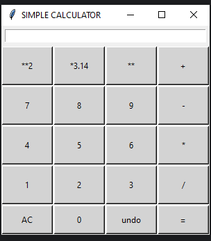

# Simple Calculator Using Tkinter

This project is a Python-based graphical user interface (GUI) calculator built using the Tkinter library. The calculator provides basic arithmetic functionalities along with additional features like undo and power calculations. This project was done to demonstrate my knowledge in using python

## Features
- **Basic Arithmetic Operations**: Add, subtract, multiply, and divide.
- **Undo Functionality**: Remove the last digit or operation entered.
- **Clear (AC)**: Clears the input field.
- **Advanced Operations**:
  - Square (`**2`)
  - Multiply by Pi (`*3.14`)
  - Exponentiation (`**`)
- **Error Handling**: Displays "Invalid Input" for invalid operations (e.g Division by Zero) and clears automatically after 1 second.

## How It Works
1. **GUI Components**:
   - An Entry widget at the top for user input and displaying results.
   - A grid of buttons for digits, operations, and functions.

2. **Functionalities**:
   - Clicking a button inserts the corresponding text or digit into the Entry widget.
   - Clicking "=" evaluates the entered expression using Python's `eval()` with safety checks.
   - The "undo" button removes the last character from the Entry field.
   - The "AC" button clears the entire input.

3. **Error Handling**:
   - Handles invalid mathematical expressions and division by zero error by displaying Invalid Input, which clears after 1 second.

## Code Highlights
- **Dynamic Button Creation**: Buttons are dynamically generated using nested loops to simplify code and improve scalability.
- **Safe Expression Evaluation**: The `ast` module is used to parse user input securely.
- **Grid System**: Tkinter's grid layout is used to organize the interface, making it responsive.

## Future Enhancements
In the future, I am thinking of implementing the below:
1. Add hover tooltips to clarify the function of advanced buttons like **2 and *3.14.
2. Display a calculation history panel for user reference.

## Requirements
- Python 3.11 or higher
- Tkinter library (pre-installed with Python)

## Screenshot
Below is a preview of the Simple Calculator GUI on Windows. The appearance of the interface may vary depending on your operating system (e.g., macOS or Windows) and system settings, such as light or dark mode preferences:



## License
This project is open-source and can be modified as needed.

## Acknowledgments
Developed using Python's Tkinter library.

## How to Run
1. Save the code in a `.py` file (e.g., `calculator.py`).
2. Run the script using Python:
   ```bash
   python calculator.py
